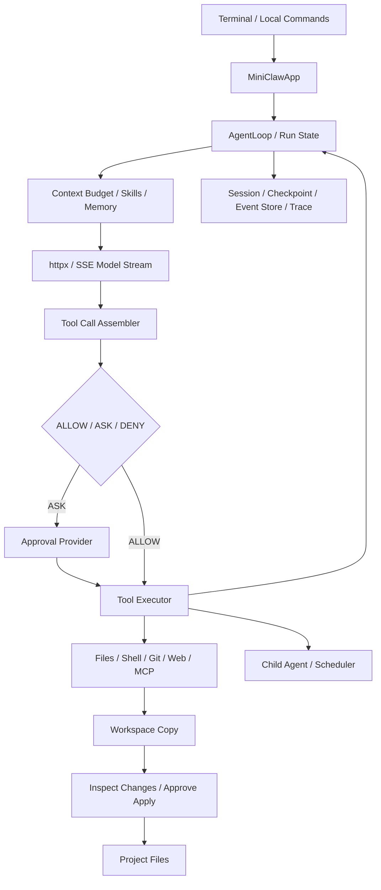

<h1 align="center">MiniClaw</h1>
<p align="center"><strong>轻量级终端 AI Agent Harness</strong></p>
<p align="center">手写运行循环 · 能力审批 · 可恢复会话 · 可审计执行</p>
<p align="center">
  <a href="https://github.com/Lh0326/miniclaw/actions/workflows/ci.yml"></a>
  
  
  <a href="LICENSE"></a>
</p>
<p align="center">简体中文 · <a href="README.en.md">English</a></p>

MiniClaw 是一个不依赖 Agent 框架或模型厂商 SDK 的终端任务 Agent。通过 `httpx` 直连兼容 OpenAI Chat Completions 的 HTTP 流式接口，仓库代码实现模型交互、工具调用、执行预算、权限审批、持久化恢复和审计的完整链路。

它把 Agent Harness 中的关键工程机制展开为可阅读、可测试的 Python 模块，适合学习运行时设计，以及扩展自己的工具与执行策略。**核心运行时仅有 1 个直接第三方依赖 `httpx`**；开发和构建工具另计，`httpx` 自身仍有传递依赖。

[快速开始](#快速开始) · [核心机制](#核心机制) · [架构](#架构) · [工具与命令](#工具与命令) · [验证](#验证) · [架构详解](docs/architecture.md) · [贡献指南](CONTRIBUTING.md)

## 核心机制

| 工程问题 | MiniClaw 的实现 |
| --- | --- |
| 模型输出与工具执行交替，容易失去运行边界 | 显式 Agent Loop 状态机、流式工具参数组装、轮数与工具调用预算 |
| 文件、Shell、Git、网络工具需要统一治理 | 工具声明文件、网络、进程、密钥、风险和幂等能力；策略统一给出 `ALLOW / ASK / DENY` |
| Agent 修改需要能检查、能批准 | 在工作区副本执行，`/changes` 检查差异，`/apply` 审批后以临时文件逐个原子替换写回 |
| 进程可能在副作用发生后、结果落盘前中断 | Checkpoint 摘要校验 + 调用/结果配对；未完成非幂等调用要求人工批准恢复 |
| 限流、超时和流式重试可能产生重复输出 | 首个模型事件发出前进行有上限的退避重试；开始输出后传播错误，不自动重开流 |
| 追加日志反复解析全量历史，成本随日志增长 | 缓存事件 ID 与各运行序号，增量建立索引，同时校验重复 ID 和序号连续性 |
| 子 Agent 与无人值守任务可能扩大权限 | 子工具白名单取交集并限制委派深度；后台 `ASK` 默认拒绝，显式预授权后才放行 |
| 真实 API 难以稳定复现异常 | FakeModel、ScriptedModel 和 HTTP MockTransport 驱动离线评测与故障注入 |

还包括上下文预算、长期记忆、计划依赖、Skills 注入、stdio MCP 客户端、后台任务调度、Token 指标和脱敏 Trace。实现细节与源码索引见 [架构详解](docs/architecture.md)。

## 快速开始

**要求：Python 3.12+，Git，uv。完整终端交互与 Process 执行后端面向 Linux / macOS；Windows 建议在 WSL2 中运行。** 原生 Windows 可以运行部分离线模块，但当前不支持 Process 后端的进程组清理、安全配置持久化和 POSIX 终端输入。

### 1. 安装

```bash
git clone https://github.com/Lh0326/miniclaw.git
cd miniclaw
uv python install 3.12
uv sync --locked --extra dev --python 3.12
```

也可用 Python 3.12+ 在独立虚拟环境中安装：`python -m pip install -e '.[dev]'`。本项目尚未发布到 PyPI。

### 2. 零 API Key 体验

```bash
uv run python examples/full_agent_flow.py --fake
```

示例在临时目录中执行：加载 Skill → 生成计划 → 委派子 Agent 读取文件 → 写入副本 → 拒绝执行命令 → 保存记忆 → 创建/取消调度任务 → 记录 Trace → 批准并应用产物。它使用脚本化模型和演示审批器，不访问真实模型服务，也不修改当前项目文件。

更多可执行示例：

| 示例 | 展示内容 |
| --- | --- |
| [minimal_harness.py](examples/minimal_harness.py) | 最小运行循环 |
| [streaming_repl.py](examples/streaming_repl.py) | 流式交互 |
| [safe_file_agent.py](examples/safe_file_agent.py) | 工作区副本与产物应用 |
| [resumable_project_agent.py](examples/resumable_project_agent.py) | 计划与会话恢复 |
| [governed_multi_agent.py](examples/governed_multi_agent.py) | 子 Agent 和后台任务权限 |

### 3. 接入真实模型

将下面的地址和模型 ID 替换为服务商提供的值。客户端请求路径为 `<base_url>/chat/completions`，要求 SSE 流、工具调用字段和完成事件符合客户端支持的协议。

```bash
uv run miniclaw config set base_url https://api.example.com/v1
uv run miniclaw config set model your-model-id
uv run miniclaw config set api_key
uv run miniclaw config show
```

`api_key` 必须交互式输入，不接受命令行明文参数。默认配置文件为 `~/.miniclaw/config.toml`；通过 `--config <path>` 可指定其他配置文件。也支持 `OPENAI_BASE_URL`、`OPENAI_MODEL`、`OPENAI_API_KEY` 环境变量，优先级高于配置文件。`.env.example` 仅作为字段参考，**程序不会自动加载 `.env`**。

然后指定待操作项目：

```bash
uv run miniclaw --workspace /path/to/your/project
```

交互示意（输出由实际模型决定）：

```text
you> 阅读项目并解释入口在哪里
you> 给 utils.py 补充类型注解，执行测试后报告结果
you> /changes
you> /apply utils.py
you> /sessions
you> /resume <session-id>
```

## 架构



### 中断恢复边界

恢复前校验 Checkpoint 摘要，再从消息历史中寻找没有对应结果的工具调用。损坏的 Checkpoint 不允许恢复；未完成的非幂等调用，以及无法证明幂等性的未知工具，必须经过恢复审批。

`/resume` 恢复消息历史，下一条输入开启新运行；不会自动逐条重放工具，也不完整还原重启前未应用的工作区副本。人工审批控制是否继续，**不提供副作用“恰好执行一次”的保证**。`idempotent` 是工具作者的能力契约，调用与结果落盘之间仍可能存在中断窗口。

### 流式重试边界

限流、5xx 与映射后的超时错误可在首个模型事件发出前重试，默认最多 4 次尝试。退避含随机抖动；数字形式的 `Retry-After` 优先使用，并受等待上限约束。HTTP 日期形式的 `Retry-After` 当前不解析。认证与协议错误不重试；一般网络连接异常不自动归入可重试错误。

### 执行与应用边界

内置文件工具在副本中操作；`/apply` 写回需要单独审批。每个文件使用同目录临时文件和原子替换，多个文件的应用不构成整体事务。Process 后端提供工作目录、环境白名单、超时和输出检查，**不强制隔离宿主文件系统或网络**。需要更强执行隔离时配置 Docker 后端。

## 工具与命令

| 类别 | 内置工具 |
| --- | --- |
| 文件 | `read_file`、`write_file` |
| 执行 | `run_command` |
| Git 只读检查 | `git_status`、`git_log`、`git_diff`、`git_show` |
| 网页 | `fetch_url`、`web_search`（配置端点后注册） |
| 记忆 | `remember`、`search_memory` |
| 计划 | `create_plan`、`list_tasks`、`start_task`、`complete_task`、`fail_task` |
| 委派 | `delegate_task` |
| 调度 | `schedule_task`、`list_scheduled_tasks`、`cancel_scheduled_task` |
| 扩展 | MCP 服务器工具，命名为 `mcp_<server>_<tool>` |

权限依据工具能力声明，不依据表格类别。默认允许只读检查和纯计算；有副作用、网络或高风险动作通常需要审批；未知能力或未声明的密钥请求拒绝执行。

| 命令 | 用途 |
| --- | --- |
| `/changes`、`/apply <path>`、`/apply --all` | 检查与批准应用修改 |
| `/sessions`、`/resume <id>`、`/clear` | 会话与恢复 |
| `/memory <query>` | 检索长期记忆 |
| `/tasks`、`/jobs` | 计划和调度任务 |
| `/skills`、`/agents`、`/mcp`、`/sandbox` | 查看扩展与执行状态 |
| `/metrics`、`/trace` | 指标和日志信息 |
| `/help`、`/exit` | 帮助与退出 |

## 扩展配置

### MCP

在 `<workspace>/.miniclaw/mcp.json` 或 `~/.miniclaw/mcp.json` 配置 stdio 服务器，项目级优先：

```json
{
  "servers": {
    "files": {
      "command": "npx",
      "args": ["-y", "@modelcontextprotocol/server-filesystem", "."]
    }
  }
}
```

也接受 `mcpServers` 键。Node.js、Docker 或具体 MCP 服务器是可选外部运行条件，不属于 Python 核心依赖。MCP 服务器能力声明见 [架构文档](docs/architecture.md)。

### 网页搜索

同级 `search.json` 通过字段映射接入搜索服务：

```json
{
  "url": "https://api.example.com/search",
  "query_parameter": "q",
  "results_path": "web.results",
  "title_field": "title",
  "url_field": "url",
  "snippet_field": "description",
  "api_key_header": "X-Api-Key"
}
```

密钥通过 `MINICLAW_SEARCH_API_KEY` 读取，配置文件中的密钥会被拒绝；未配置端点时不注册 `web_search`。`fetch_url` 进行 URL/DNS 防护并提取静态 HTML 正文，不执行 JavaScript。

### Skills 与后台预授权

在 `<workspace>/.miniclaw/skills/<name>/SKILL.md` 中添加 `name`、`description`、`triggers`、`scope` frontmatter 与指令正文。命中触发词时注入上下文，并记录 `ContextInjected` 事件。

后台无人值守策略将 `ASK` 转为拒绝。如确有需要，可在程序接入时显式预授权工具：

```python
app = await create_app(config, unattended_approved_tools=("fetch_url",))
```

## 验证

本次 Linux / Python 3.12 验证收集 **517 项测试：516 项通过，1 项 Docker 集成测试因配置镜像不可用跳过**；**10 项基础离线 Evals 全部通过**。Ruff、完整离线验收脚本、wheel 构建与独立安装也已通过。

测试验证运行时行为；基础 Evals 检查脚本化输入的文本拼接、完成状态、事件类型出现与中文输出，事件顺序另由自动化测试验证。这些数量不代表覆盖率，也不代表真实模型任务成功率。

```bash
uv run ruff check .
uv run pytest -q
uv run python -m miniclaw.evals.cli run tests/fixtures/evals/core.json --output .verification
uv run python examples/full_agent_flow.py --fake
uv run python scripts/scan_repository.py
```

Linux / macOS 上可用 `bash scripts/smoke_offline.sh` 执行完整离线验收。[CI](.github/workflows/ci.yml) 执行 lint、测试、离线示例、仓库检查，以及 wheel 构建后的独立安装检查，全程无需真实 API Key。

故障测试见 [test_model_retry.py](tests/model/test_model_retry.py)、[test_fault_injection.py](tests/evals/test_fault_injection.py)、[test_checkpoint_recovery.py](tests/sessions/test_checkpoint_recovery.py) 和 [test_event_store_scaling.py](tests/observability/test_event_store_scaling.py)。真实模型冒烟测试需要自行配置凭据，未纳入默认 CI。

## 当前限制

- Token 计数为按文字脚本估算的启发式值；超预算时按优先级裁剪，不自动生成摘要。
- Child Agent 共享 Provider 与执行后端；权限和预算隔离不等于独立进程隔离。
- `/apply` 审批绑定路径列表，未绑定内容摘要；当前不应用删除操作。
- 工作区复制不按 `.gitignore` 排除文件。请选择适合任务的工作目录；Process 或外部 MCP 工具仍受其自身运行环境影响。
- Trace 始终启用；Trace 使用脱敏器，但事件存储与 Checkpoint 保留原始上下文，日志脱敏不能替代访问控制。
- MCP 仅支持 stdio 与 tools，不支持 HTTP/SSE transport、resources 或 prompts。
- Scheduler 基于单个 SQLite 文件的任务认领，未面向多机部署。
- Sandbox 后端在启动时选择，运行中不自动切换。

## 参与与许可

欢迎通过 [Issue](https://github.com/Lh0326/miniclaw/issues) 反馈可复现问题或提交 Pull Request。开始前请阅读 [贡献指南](CONTRIBUTING.md)；安全问题请参考 [SECURITY.md](SECURITY.md)。

[MIT License](LICENSE)。维护者：[Lh0326](https://github.com/Lh0326)。

文档组织参考 [Aider](https://github.com/Aider-AI/aider/blob/main/README.md) 和 [llama.cpp](https://github.com/ggml-org/llama.cpp/blob/master/README.md) 的项目介绍、快速开始、验证与贡献入口；实现以本仓库源码为准。