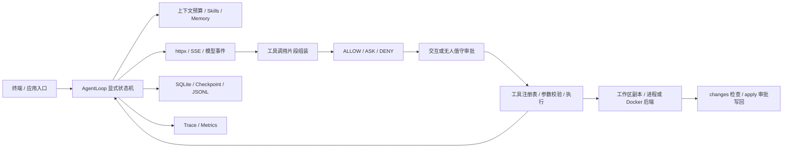
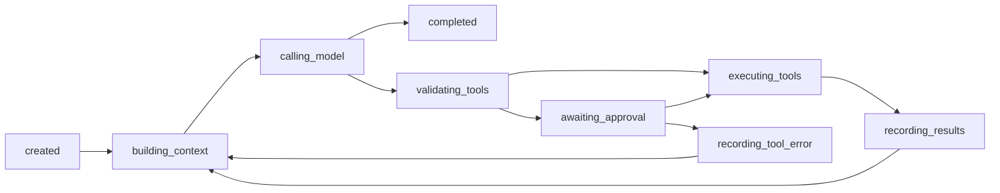

# 架构与运行边界

MiniClaw 是用 Python 手写的终端 Agent Harness。
它将模型流、工具执行、审批、会话状态和审计组织成可检查的运行链路。
本文以当前源码为准，解释关键实现及其边界，便于阅读、复现和扩展。

## 1. 模块与数据流

| 职责 | 主要源码 |
| --- | --- |
| 应用装配、终端命令、会话恢复 | [app.py](../src/miniclaw/app.py)、[cli](../src/miniclaw/cli/) |
| 运行循环、状态迁移、执行预算 | [agent](../src/miniclaw/agent/) |
| HTTP、SSE 和模型事件协议 | [model](../src/miniclaw/model/) |
| 工具定义、组装、注册和执行 | [tools](../src/miniclaw/tools/) |
| 权限和审批实现 | [permissions](../src/miniclaw/permissions/) |
| 工作区路径约束、差异、写回 | [workspace](../src/miniclaw/workspace/) |
| 会话索引、Checkpoint、事件日志 | [sessions](../src/miniclaw/sessions/) |
| 委派与后台任务 | [subagents](../src/miniclaw/subagents/)、[scheduler](../src/miniclaw/scheduler/) |
| 可重复评测与故障注入 | [evals](../src/miniclaw/evals/)、[tests](../tests/) |

[pyproject.toml](../pyproject.toml) 中的直接运行时依赖只有 `httpx`。
SQLite、JSON、文件操作和异步执行使用 Python 标准库；开发工具不计入运行时依赖。
项目没有依赖 LangChain、LangGraph 等 Agent 框架。

## 2. 手写 Agent Loop

[AgentLoop](../src/miniclaw/agent/loop.py) 每次运行创建独立 `run_id`，并沿用或新建 `session_id`。
每轮构建请求上下文，消费模型事件，再按完成原因决定输出答案或执行工具。
[state.py](../src/miniclaw/agent/state.py) 用枚举和迁移表限制合法状态变化。

图中省略失败、取消和预算耗尽分支，完整迁移以源码为准。
非法迁移会抛出 `InvariantViolation`，避免任意状态跳转。

- `TextDelta` 逐段拼接，`ResponseCompleted("stop")` 结束当前运行。
- `ToolCallDelta` 按索引累积名称、调用 ID 和 JSON 参数片段。
- [ToolCallAssembler](../src/miniclaw/tools/assembler.py) 拒绝身份冲突、缺少身份和非法 JSON。
- 工具参数经过 [schema.py](../src/miniclaw/tools/schema.py) 校验，执行结果重新进入消息历史。
- `max_turns` 和 `max_tool_calls` 约束模型轮数及累计工具调用数。

当前循环按顺序执行同一轮工具。工具调用批次在执行前统一检查预算，避免部分超额执行。
[RunLimits](../src/miniclaw/agent/limits.py) 声明了 `timeout_seconds`，但循环尚未使用它执行运行总时限。
HTTP 超时与进程工具超时在各自适配器中控制。

## 3. 能力声明与统一审批

[ToolCapabilities](../src/miniclaw/tools/types.py) 描述文件访问、网络、子进程、秘密变量、风险、副作用及幂等性。
[DefaultPermissionPolicy](../src/miniclaw/permissions/policy.py) 将这些声明映射为三级决策。

| 决策 | 典型情况 | 执行行为 |
| --- | --- | --- |
| `ALLOW` | 纯计算、只读文件、满足声明条件的低风险只读检查 | 直接执行 |
| `ASK` | 工作区写入、副作用、无限制网络、关键风险工具 | 请求审批，批准后执行 |
| `DENY` | 未声明的秘密请求、无法识别的能力值 | 返回权限拒绝结果 |

上述是典型分类，组合能力的优先级以策略源码为准。
幂等并不意味着可以跳过审批：`write_file` 声明幂等，但存在写入副作用，仍需 `ASK`。
CLI 审批仅接受 `y`，单个审批请求 ID 不能重复消费；缺少审批提供者时 `ASK` 被拒绝。

权限机制依赖工具作者准确声明能力，并依赖处理函数实际遵守约束。
新增工具不能仅靠填写低风险声明就获得安全保证。

## 4. 执行、检查、应用文件变更

[WorkspaceSession](../src/miniclaw/workspace/session.py) 将项目复制到独立工作目录，复制时排除符号链接。
内置文件工具使用 [resolve_workspace_path](../src/miniclaw/workspace/paths.py) 拒绝绝对路径及解析后越出工作区的路径。
模型运行阶段的文件修改首先发生在副本内。

1. **执行**：文件工具和命令工具以副本为工作区。
2. **检查**：`/changes` 比较副本与真实项目，展示文件差异。
3. **应用**：`/apply <path>` 或 `/apply --all` 请求审批，再把选择的文件写回真实项目。

写回前校验工作区清单和目标路径。每个文件在目标目录内创建临时文件，写入后 `flush`、`fsync`，再用 `replace` 替换目标。
批准的应用操作完成后追加 `ArtifactApplied` 事件。

这里的原子性是**逐文件替换**：多文件应用中后续文件失败时，已应用文件不会自动回滚。
目前写回路径以副本中仍存在的文件为清单，不提供删除同步或多文件事务。
工具副作用与审计落盘之间也不存在统一事务。

## 5. 中断后的 Checkpoint 恢复

[FileCheckpointStore](../src/miniclaw/sessions/checkpoints.py) 将消息历史、状态、事件序号及完成调用 ID 编码为 JSON。
保存时先写临时文件并同步，再替换正式文件；SQLite 索引记录路径和 SHA-256 摘要。
读取时校验摘要并解码；缺失、摘要不匹配或结构无效的 Checkpoint 无法用于恢复。
摘要用于检测文件损坏，不构成防恶意篡改的签名。

工具执行与结果持久化之间存在不确定窗口：工具可能已经产生副作用，但结果尚未保存。
循环先把助手工具调用写入 Checkpoint，之后执行，再逐项记录工具结果。
[pending_tool_executions](../src/miniclaw/sessions/recovery.py) 遍历消息，以调用 ID 配对 `ToolCall` 和 `ToolResultContent`。
没有配对结果的调用视为未完成；未知工具无法证明幂等，按非幂等处理。

| 条件 | 恢复判断 |
| --- | --- |
| Checkpoint 不可用 | `UNRECOVERABLE` |
| 存在未完成的非幂等调用 | `REQUIRES_APPROVAL` |
| 其余情况 | `RESUME` |

`/resume <session-id>` 对 `REQUIRES_APPROVAL` 请求单独的 `resume_session` 审批。
拒绝或无法审批时不会恢复该历史；批准后恢复消息，并提示存在未完成操作。
这个门禁避免在操作者不知情时继续有副作用疑点的会话。

当前恢复语义是**恢复对话历史**：下一条输入创建新的运行，不自动精确重放原执行现场。
它不能判定外部副作用是否已经发生，也不提供恰好一次执行保证。
应用重启会创建新的工作区副本，恢复历史不等于恢复先前副本中尚未应用的文件。

## 6. 流式重试的安全边界

[OpenAICompatibleClient](../src/miniclaw/model/openai_compat.py) 通过 `httpx.AsyncClient.stream` 请求 `chat/completions`。
[SSEDecoder](../src/miniclaw/model/sse.py) 处理分块数据，[openai_stream.py](../src/miniclaw/model/openai_stream.py) 转换文本、工具片段及完成事件。

重试分界是**首个模型事件已经发出**，包括文本和工具片段，而不仅是屏幕已打印文本。
首个事件前遇到 `429`、`5xx` 或映射后的 HTTP 超时，可以自动重试；默认最多尝试 4 次。
首次事件发出后，错误直接传播，避免重新开流重复已交付内容。

无服务端等待指示时，指数窗口从 0.5 秒增长，在窗口的后半区随机取值，默认上限 20 秒。
数值形式的非负 `Retry-After` 秒数优先使用，也受相同上限约束。
当前不解析 HTTP 日期形式的 `Retry-After`，也未将所有连接类网络错误统一纳入自动重试。
认证失败和协议错误不会自动重试。

## 7. 事件索引缓存与审计

[JsonlEventStore](../src/miniclaw/sessions/events.py) 保存事件 ID 集合与每个 `run_id` 的最后序号。
正常连续追加在内存索引上检查，减少每个流片段都重新读取历史造成的重复处理。
文件大小变化时重新加载索引，以识别其他存储实例的追加。

- 完全相同的事件 ID 和内容重复追加被忽略。
- 同一事件 ID 对应不同内容时抛出持久化错误。
- 每个运行的事件序号必须从 1 连续增长，不同运行独立计数。

重复 ID 分支仍需加载历史，常规追加路径才使用缓存。
缓存以文件大小探测外部变化，无法识别同大小改写；实现没有跨进程写锁。
日志加载负责解码，未对已有全量历史重新校验所有重复 ID 和序号连续性。
因此它适合当前受控写入方式，不应作为并发写入或任意篡改检测的保证。

[JsonlTraceSink](../src/miniclaw/observability/trace.py) 另存审计 Trace，经过 [Redactor](../src/miniclaw/observability/redaction.py) 处理敏感字段和已知秘密值。
Checkpoint 和主事件日志保留运行上下文，不能视为已全部脱敏的数据。

## 8. 子 Agent、后台任务与执行后端

[SubagentRuntime](../src/miniclaw/subagents/runtime.py) 对请求工具集与父工具白名单取交集，并检查委派深度、子任务数量和预算。
[delegate_task](../src/miniclaw/subagents/tools.py) 还会拒绝显式请求父级未授权工具的调用。
[AgentLoopFactory](../src/miniclaw/subagents/factory.py) 创建独立子运行和消息历史，复用父级策略与审批提供者。
子 Agent 使用同一工作区和已注册工具处理函数；此处隔离是运行身份、历史和工具权限范围。
应用默认允许最多 4 个子任务、深度最多 2 层，默认子工具白名单不包含再委派工具。

后台任务使用单独的循环和空历史。
[UnattendedApprovalProvider](../src/miniclaw/permissions/approval.py) 默认拒绝 `ASK`，只接受明确预授权的工具名称。
应用默认预授权集合为空，并从后台工具表移除 `delegate_task`，避免通过子 Agent 接入交互审批。

| 后端 | 当前保障与限制 |
| --- | --- |
| [ProcessSandbox](../src/miniclaw/sandbox/process.py) | 约束工作目录、环境变量、超时和返回输出大小；不强制网络或 OS 文件隔离；Windows 不支持该执行路径 |
| [DockerSandbox](../src/miniclaw/sandbox/docker.py) | 使用预先存在的允许镜像、禁网、只读容器根、工作区挂载及 CPU / 内存 / PID 限制；依赖可用的 Docker |

启用强后端但 Docker 不可用时，应用启动失败，不静默降级。
输出大小是在进程完成收集后检查，不能解释为流式内存上限。

## 9. 离线验证与持续集成

[FakeModel](../src/miniclaw/model/fake.py) 和 [ScriptedModel](../src/miniclaw/model/scripted.py) 让运行流程无需真实 API Key 即可复现。
[基础评测集](../tests/fixtures/evals/core.json) 包含 10 条脚本案例，验证文本拼接、完成状态、中文、换行和事件类型出现。
其中 `event_sequence_contains` 检查类型是否出现，未断言类型出现顺序。
这些评测验证 Harness 行为，不代表真实模型的推理能力或工具选择质量。

| 验证关注点 | 测试证据 |
| --- | --- |
| 重试次数、退避、等待指示与输出后边界 | [test_model_retry.py](../tests/model/test_model_retry.py) |
| 恢复配对、未知工具和拒绝审批 | [test_session_resume.py](../tests/sessions/test_session_resume.py) |
| 日志缓存与重复 / 序号校验 | [test_event_store_scaling.py](../tests/observability/test_event_store_scaling.py) |
| 工作区检查、审批及应用 | [test_apply_command.py](../tests/app/test_apply_command.py)、[test_safe_file_agent.py](../tests/workspace/test_safe_file_agent.py) |
| 故障注入与委派 / 后台权限 | [test_fault_injection.py](../tests/evals/test_fault_injection.py)、[test_subagent_factory.py](../tests/subagents/test_subagent_factory.py)、[test_scheduler_worker.py](../tests/scheduler/test_scheduler_worker.py) |

[CI](../.github/workflows/ci.yml) 在 Linux 和 macOS 运行静态检查、测试及离线验收，并验证构建后的 wheel 可安装。
完整测试数量和通过状态应以对应提交的实际运行结果为准。
